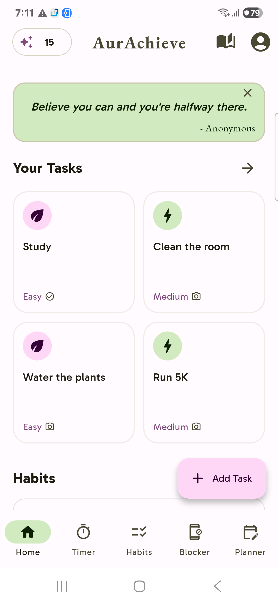
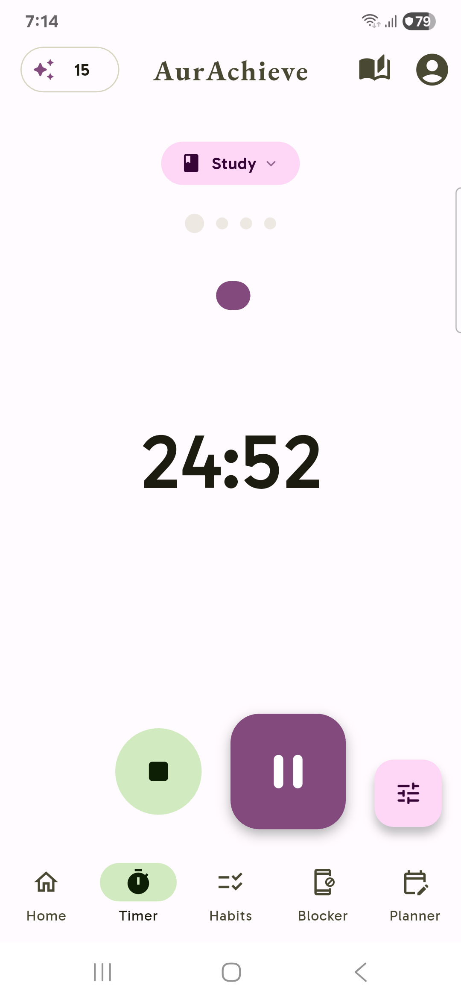
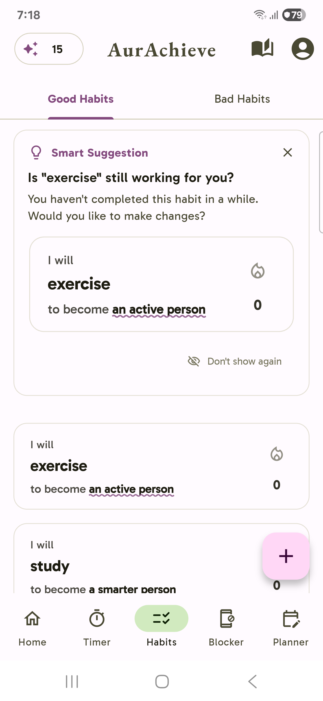
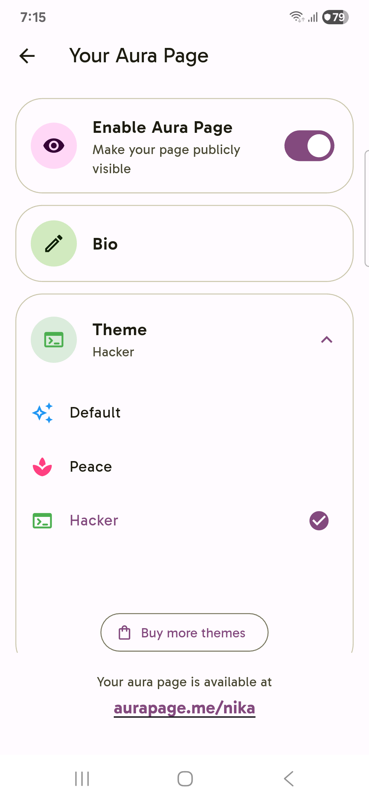
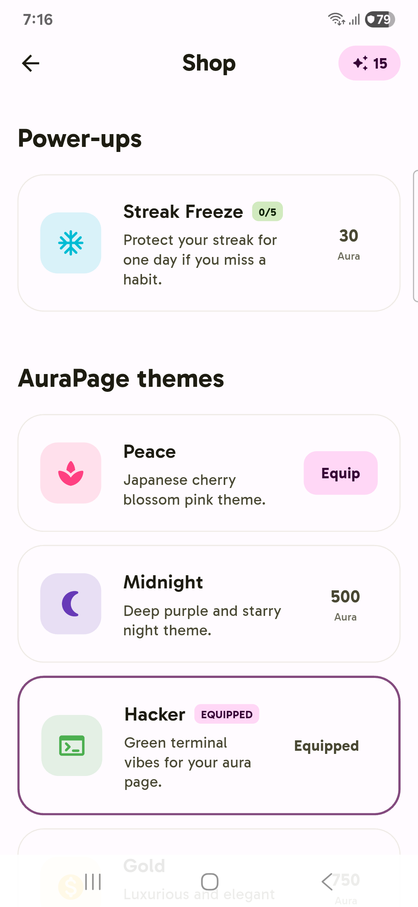

# AurAchieve

**Fix your life.**

AurAchieve is the only self-improvement app you need. Master your habits. Boost your aura.

## Demo video
https://quickshare.samsungcloud.com/s3UEEmAPTWYR

## Links

Get it now through [GitHub releases](https://github.com/NiceSapien/AurAchieve/releases).

Get into the community for insider news and updates: [Discord](https://discord.gg/XQ5U7p7bdz)

Pre-register for release: [Google forms](https://docs.google.com/forms/d/e/1FAIpQLSdA6v4FyNCA9lzf_E-mPBP-PtF9ioedzijNrLCMPM9F_WuFgA/viewform?usp=header) (Google Play Pre-registration opens soon!)
## About
### Screenshots
Click on any image to enlarge it.
<table>
	<tr>
		<td></td>
		<td></td>
		<td></td>
		<td></td>
        <td></td>
	</tr>
</table>

### Features

- A habit tracker: Build good habits, one step at a time. Let go of your bad habits forever. Sometimes, it seems like nothing is happening when you're trying to form a good habit; a habit tracker allows you to see progress.

- Memory Lanes: One of the best journal/diaries you'll ever find. Supports End-to-End encryption so no one except for you, not even us, can look at your personal diaries. You can also store images, videos, audio recordings and more. Store your memories and you can take a trip down your memory lane anytime.

- Social Media Blocker: One of a kind. Unlike other blockers that block your access from the app, AurAchieve requires you to change the password of your social media accounts - and it doesn't let you login until the timeout you set.

- Study Planner: If you are a student, you can prepare for an upcoming exam easily. Just enter your subjects and chapters, and boom! That's it. The app will create a study plan for you to follow until your set deadline. Don't follow it, lose aura. Follow it, gain aura.

- Focus Timer: Focus on what you're doing properly and get aura. Includes a pomodoro timer to help you take small breaks in between.

- Aura Pages: Get yourself a aura page. Its like a social media page of yourself, except for its built to showcase the best of your achievements, memories, and aura.

- Shop: Buy streak freezes for your habits, themes for your aura page, and so much more. No real money involved - you spend your aura for whatever you buy.

- Tasks: Complete one-time tasks to gain aura.

## Self-hosting

If you wish to self-host AurAchieve for some reason, you'll have to clone and deploy the [backend](https://github.com/NiceSapien/AurAchieve-backend) repository, written in ExpressJS. The instructions to setup the backend are present in the repository readme.

To setup the frontend, you can either build the apk with your server URL preset or you can use the official version and set your own URL. To do so, tap on the main intro screen (before signup/login) 7 times and a prompt to enter your server URL will open. Just enter it and you'll be connected to your own server. Alternatively if you'd like to build the APK yourself, follow these steps:

1. Clone the repository
2. Install flutter and download packages

```bash
pub get && flutter pub get
```

3. Edit lib/api_service.dart with your own backend URL.

4. Update lib/main.dart with you own appwrite project. Do **not** use AurAchieve's project ID, or your self hosted version won't work!

5. Build. That's all.

```bash
flutter build apk --profile
```

## Contributing

There's not much about contributing yet. Make sure to deploy your own backend and not use AurAchieve's server URL for testing. After you're done, revert it back to ours and make a pull request. Here's how you may make commits:

`feat`: For new features

`improve`: For improvement of existing features

`fix`: For bug fixes

`delete`: For deleting something

`upgrade`: For upgrading/updating something, such as dependencies

`docs`: Anything related to documentation and not to the codebase itself

`refactor`: When refactoring some part of the codebase.

## Sponsors

- [Renarin Kholin](https://github.com/renarin-kholin), $15

If you appreciate AurAchieve and want to keep it free for everyone, hit the [sponsor](https://github.com/sponsors/NiceSapien) button. You can also do this through [patreon](https://patreon.com/nicesapien), but GitHub sponsors is preferred over Patreon as it charges less. The codebase is provided under the MIT license absolutely free of charge.


Current goals:

Any amount - Show appreciation and help keep AurAchieve free

**100$** - Publish AurAchieve on the Apple App Store

**1000$** - Buy me a MacBook to make iOS development easier, quicker, more efficient and introduce more features to the iOS version!
