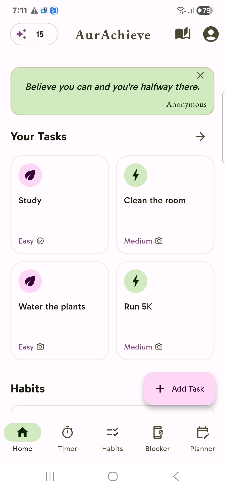
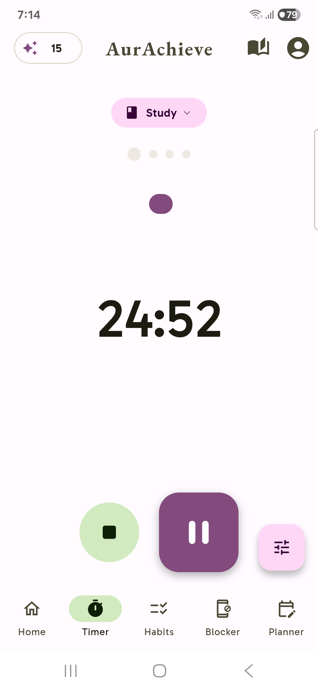
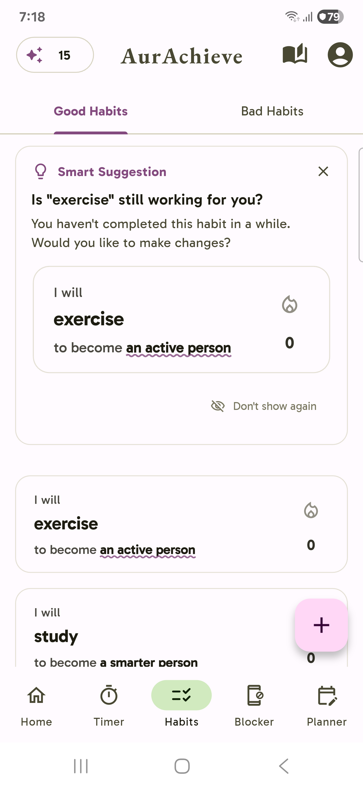
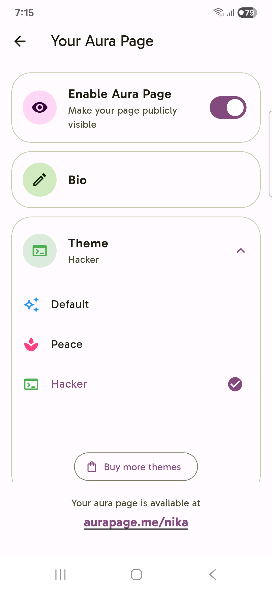
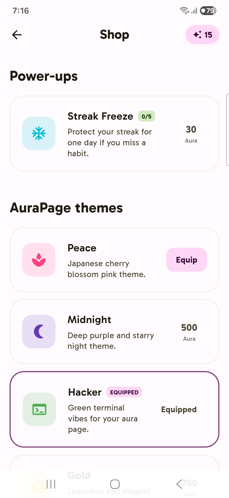

# AurAchieve

**Fix your life.**

AurAchieve is the only self-improvement app you need. Master your habits. Boost your aura.
[Screenshots](#screenshots) <br>
[Demo video](https://youtube.com/shorts/6ZlfTz8Uq4M?si=AXeQnWxzrNsYBicQ)
## Links

Get it now through [GitHub releases](https://github.com/NiceSapien/AurAchieve/releases).

Get into the community for insider news and updates: [Discord](https://discord.gg/XQ5U7p7bdz)

Pre-register for release: [Google forms](https://docs.google.com/forms/d/e/1FAIpQLSdA6v4FyNCA9lzf_E-mPBP-PtF9ioedzijNrLCMPM9F_WuFgA/viewform?usp=header) (Google Play Pre-registration opens soon!)
## About
### Screenshots

<div align="center">
  <p>
    
    
    
  </p>
  <p>
    
    
  </p>
</div>

### Features

- A habit tracker: Build good habits, one step at a time. Let go of your bad habits forever. Sometimes, it seems like nothing is happening when you're trying to form a good habit; a habit tracker allows you to see progress.

- Memory Lanes: One of the best journal/diaries you'll ever find. Supports End-to-End encryption so no one except for you, not even us, can look at your personal diaries. You can also store images, videos, audio recordings and more. Store your memories and you can take a trip down your memory lane anytime.

- Social Media Blocker: One of a kind. Unlike other blockers that block your access from the app, AurAchieve requires you to change the password of your social media accounts - and it doesn't let you login until the timeout you set.

- Study Planner: If you are a student, you can prepare for an upcoming exam easily. Just enter your subjects and chapters, and boom! That's it. The app will create a study plan for you to follow until your set deadline. Don't follow it, lose aura. Follow it, gain aura.

- Focus Timer: Focus on what you're doing properly and get aura. Includes a pomodoro timer to help you take small breaks in between.

- Aura Pages: Get yourself a aura page. Its like a social media page of yourself, except for its built to showcase the best of your achievements, memories, and aura.

- Shop: Buy streak freezes for your habits, themes for your aura page, and so much more. No real money involved - you spend your aura for whatever you buy.

- Tasks: Complete one-time tasks to gain aura.

## Self-hosting

If you wish to self-host AurAchieve, you will need to clone and deploy the [backend](https://github.com/NiceSapien/AurAchieve-backend) repository, written in ExpressJS. The setup instructions for the backend are available in its repository's README.

To configure the official frontend app to connect to your self-hosted backend:
1. Tap the main intro screen (before signing up or logging in) **7 times** to open the server URL configuration prompt.
2. Enter your self-hosted server's root URL.
3. The app will fetch configuration parameters from the server. Ensure that your backend returns the following JSON fields at the root endpoint:
   - `appwriteEndpoint`: The URL of your Appwrite server.
   - `appwriteProjectId`: Your Appwrite project ID.
   - `memoryLanesBucketId`: The storage bucket ID used for memory lane file attachments.
   - `profileBucketId`: The storage bucket ID used for profile pictures.
4. **Validation Check**: The app will automatically connect to Appwrite and verify that the specified Project ID and both Storage Bucket IDs exist. If any bucket is missing or the project configuration is incorrect, the app will reject the connection and display a clear error message.

Alternatively, if you'd like to build the APK yourself with pre-configured defaults, follow these steps:

1. Clone the repository.
2. Install Flutter and get dependencies:

```bash
flutter pub get
```

3. Edit `lib/api_service.dart` and update the `defaultBaseUrl` in the `AppConfig` class with your own backend URL.

4. Also update the default Appwrite settings in `lib/api_service.dart` (`defaultAppwriteEndpoint`, `defaultAppwriteProjectId`, `defaultProfileBucketId`, and `defaultMemoryLanesBucketId`) with your self-hosted credentials.

5. Build:

```bash
flutter build apk --release
```

## Contributing

There's not much about contributing yet. Make sure to deploy your own backend and not use AurAchieve's server URL for testing. After you're done, revert it back to ours and make a pull request. Here's how you may make commits:

`feat`: For new features

`improve`: For improvement of existing features

`fix`: For bug fixes

`delete`: For deleting something

`upgrade`: For upgrading/updating something, such as dependencies

`docs`: Anything related to documentation and not to the codebase itself

`refactor`: When refactoring some part of the codebase.

## Sponsors

- [Renarin Kholin](https://github.com/renarin-kholin), $15

If you appreciate AurAchieve and want to keep it free for everyone, hit the [sponsor](https://github.com/sponsors/NiceSapien) button. You can also do this through [patreon](https://patreon.com/nicesapien), but GitHub sponsors is preferred over Patreon as it charges less. The codebase is provided under the MIT license absolutely free of charge.


Current goals:

Any amount - Show appreciation and help keep AurAchieve free

**100$** - Publish AurAchieve on the Apple App Store

**1000$** - Buy me a MacBook to make iOS development easier, quicker, more efficient and introduce more features to the iOS version!
